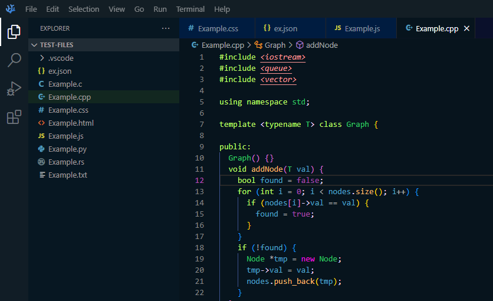

# NeoInked - VS Code Dark Theme

NeoInked is a dark theme for VSCode that was made because dark+ can still be too light and other themes dont use all the colors I like

## Preview


NeoInked currently has been tested on : C/C++, Rust, Javascript, Python, HTML, CSS, and plain text files.

## Installation
Right now the theme is not listed on VSCode extension marketplace but hopefully it should be soon. <br>
<br>
If you want to try the theme out you can donwload the .vsix file and open it in a workspace in VSCode, you can then right click on it and hit install and the theme should be where you select your other themes

<!-- Alternatively, you can download the extension from the [Visual Studio Code Marketplace](https://marketplace.visualstudio.com/items?itemName=your-username.NeoInked) and install it manually. -->


## Customization

If you want to customize the theme, you can do so by creating a `settings.json` file in your `.vscode` folder and adding the following code:

```json
{
  "workbench.colorTheme": "NeoInked",
  "editor.tokenColorCustomizations": {
    "comments": "#888888",
    "strings": "#ff0000",
    "numbers": "#008000"
  }
}
```

## Problems/Issues
If you encounter a problem or issue feel free to open a new issue on my [github](https://github.com/Lamperr/NeoInked/issues) 